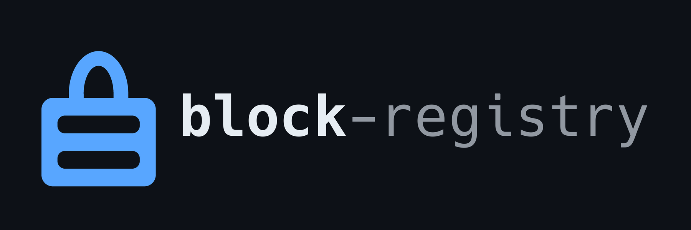

<!-- ALL-CONTRIBUTORS-BADGE:START - Do not remove or modify this section -->
[](#contributors-)
<!-- ALL-CONTRIBUTORS-BADGE:END -->

[](https://github.com/nao1215/block-registry/actions/workflows/validate.yml)
[](https://github.com/nao1215/block-registry/actions/workflows/website.yml)


<p align="center">
  
</p>

Recipes that tell [block](https://github.com/nao1215/block) how to find and fetch blockchain development tools. This repository is the only place recipes are written: block vendors a copy of one revision of `registry/` into its own tree and embeds it, so `block list` and `block lock` work offline and a given block version always pairs with a registry it was tested against.

Documentation: https://nao1215.github.io/block-registry/

```console
$ block list cosmos
NAME             COMMANDS        DESCRIPTION
celestia-app     celestia-appd   Celestia consensus node (celestia-appd)
celestia-node    celestia        Celestia data-availability node: bridge, full and light nodes
cometbft         cometbft        Byzantine fault-tolerant consensus engine and node behind Cosmos SDK chains
cosmos-relayer   rly             IBC relayer for Cosmos SDK chains written in Go, run as rly
cosmovisor       cosmovisor      Supervises a Cosmos SDK node binary across scheduled chain upgrades
gaia             gaiad           Cosmos Hub node (gaiad)
hermes           hermes          IBC relayer connecting Cosmos SDK chains, written in Rust
ignite           ignite          Scaffolds, builds and serves Cosmos SDK blockchains
osmosis          osmosisd        Osmosis appchain node (osmosisd), the Cosmos AMM
```

This repository holds the data behind that listing. The
[catalog site](https://nao1215.github.io/block-registry/) renders the same files
with a filter box, and the pages beside it are the recipe format and the
walkthrough for adding a tool.

## A recipe is a rule, not a list of versions

```text
upstream publishes a release
        ↓
block discovers it from the repository's tags
        ↓
the recipe says which artifact to take for each platform
```

A new upstream version needs no change here. A recipe changes only when an
upstream renames its assets, moves repositories, changes how it distributes
builds, or drops a platform.

```toml
# registry/hermes.toml
name = "hermes"
ecosystems = ["cosmos", "ibc"]
description = "IBC relayer connecting Cosmos SDK chains, written in Rust"

[source]
type = "github_release"
repo = "informalsystems/hermes"
asset = "hermes-v{version}-{arch}-{os}.tar.gz"
platforms = ["linux/amd64", "linux/arm64", "darwin/amd64", "darwin/arm64"]
bin = ["hermes"]

[source.os]
linux = "unknown-linux-gnu"
darwin = "apple-darwin"

[source.arch]
amd64 = "x86_64"
arm64 = "aarch64"
```

The full field reference is in
[the recipe format](https://nao1215.github.io/block-registry/recipe/), and the
machine-readable copy is [schema/recipe.schema.json](./schema/recipe.schema.json).

## What is in here

<!-- BEGIN CATALOG (generated by "make doc"; edit the recipes, not this table) -->

48 tools across 17 blockchain systems, enough that a project's toolchain —
node, compiler, test runner, relayer — can be pinned without reaching for
anything else.

| Ecosystem | Tools |
| --- | --- |
| aptos | `aptos` |
| avalanche | `avalanche-cli`, `avalanchego` |
| bitcoin | `bitcoin-core`, `btcd`, `ord` |
| cardano | `cardano-node` |
| celestia | `celestia-app`, `celestia-node` |
| cosmos | `celestia-app`, `celestia-node`, `cometbft`, `cosmos-relayer`, `cosmovisor`, `gaia`, `hermes`, `ignite`, `osmosis` |
| ethereum | `anvil-zksync`, `besu`, `echidna`, `erigon`, `ethdo`, `foundry`, `geth`, `geth-tools`, `grandine`, `hevm`, `lighthouse`, `medusa`, `nimbus-eth2`, `prysm`, `prysm-validator`, `reth`, `solc`, `sp1`, `vyper` |
| fabric | `fabric` |
| ibc | `cosmos-relayer`, `hermes` |
| icp | `dfx` |
| ipfs | `kubo` |
| near | `near-cli` |
| solana | `agave`, `anchor`, `solana-verify`, `surfpool` |
| starknet | `scarb`, `starkli`, `starknet-foundry` |
| stellar | `stellar` |
| zk | `circom`, `sp1` |
| zksync | `anvil-zksync` |

The commands each of them puts on your PATH are in the
[catalog](https://nao1215.github.io/block-registry/#catalog), rendered from
these same files.

<!-- END CATALOG -->

A tool serving several systems is listed under each: Hermes is reached for
from both Cosmos and IBC work, Celestia's binaries are Cosmos SDK binaries.

### Not here, and why

An absence is a decision, so the notable ones are written down rather than
left to be rediscovered:

| Tool | Why not |
| --- | --- |
| Sui | The release archive carries a 3.7 GB `sui-debug` build beside the 217 MB CLI, and block extracts an archive whole. Installing four gigabytes to get one command is not an install. |
| Nethermind | Its zip contains symbolic links, and block refuses to extract links rather than reason about where they point. |
| Lotus | The published binary links against system libraries (`libhwloc`) that block neither ships nor installs, so it would install and then fail to start. |
| Besu, Teku | Java archives that need a JVM block does not manage. |
| TON | Release tags are dated `v2026.08`, which is not a version block can order (`08` is not a number with a leading zero). |
| lnd, Algorand | Every release is tagged as a pre-release (`-beta`, `-stable`), and block never resolves a pre-release. |
| Hardhat, Slither, Mythril | Distributed through npm and PyPI only; block does not manage language runtimes or their package managers. |

## Where a recipe downloads from

The catalog grows; where it downloads from must not drift while it does. So
the rule is written down and enforced, not left to whoever writes the recipe.

| Tier | Method | What it means |
| --- | --- | --- |
| 1 | `github_release` | An asset of a release of the same repository the version tags come from. GitHub publishes the asset's SHA-256, and block records it. |
| 2 | `http` | A prebuilt artifact on a host listed in [policy/hosts.toml](./policy/hosts.toml), for an upstream that publishes binaries but does not attach them to its releases. |

Tier 2 is for the upstreams that genuinely need it — today Bitcoin Core and
go-ethereum (twice: `geth` and `geth-tools`), both of which build binaries
and publish them on their own server rather than on GitHub. Each entry names the one repository the host
serves and why tier 1 will not do, and `registry-lint` refuses a recipe whose
url reaches anywhere else, a url whose host is itself a placeholder, and a
`github.com` url wearing type `http` when `github_release` would carry the
digest. An entry no recipe uses is reported too, so the list of hosts block
downloads from shrinks as well as grows.

There is no third tier. No `install = "curl ... | bash"`, no `command =
"make install"`, no arbitrary-script escape hatch, and no package-manager
shell-out — a recipe is data block interprets, and adding a tool can never
add a way to run something. block does not manage language runtimes (Go,
Rust, Node, Python) either, which is why tools distributed only through npm,
PyPI or crates.io are not here.

## Adding or fixing a tool

```shell
make lint       # validate every recipe, offline
make test       # the linter's own tests
make doc-check  # the README catalogue still matches the recipes
```

Then try the recipe as a project-local source before opening a pull request —
the format is identical, so `block lock && block sync && block exec <tool>
--version` is exactly what a user will experience. The full walkthrough is in
[Adding a tool](https://nao1215.github.io/block-registry/contributing/).

## How block takes these recipes

block does not depend on this repository as a Go module and never fetches it
at run time. It vendors a copy:

```text
block-registry @ <sha>
      │  make registry-sync   in block: fetches this revision, replaces
      │                       block/registry/*.toml, writes block/registry/SNAPSHOT
      ▼
block/registry/   generated; embedded in the binary with go:embed
      │  make registry-verify in block: recomputes the digest of those files
      │                       and fails if they were edited there
      ▼
a block release   `block version` prints the revision it carries
```

That is why `go install github.com/nao1215/block@latest` stays a single
self-contained download, and why a recipe fixed in block's copy rather than
here is caught rather than shipped.

Only `registry/` crosses over. `policy/hosts.toml`, `schema/`,
`cmd/registry-lint` and the catalog site stay here: they are how a recipe is
reviewed before it is merged, not something block executes. block chooses no
download source — it executes the one the recipe names — and a project-local
`[tools.<name>.source]` in someone's `block.toml` is deliberately free to
point wherever its author needs, so a host allowlist is a rule about *this
repository's* contents, enforced at this gate.

## How this is checked

| Check | Where | When |
| --- | --- | --- |
| File name, ecosystems, description, source shape, executable-path safety | here (`registry-lint`) | every push and pull request |
| Download host against `policy/hosts.toml` | here (`registry-lint`) | every push and pull request |
| Recipes match the published JSON Schema | here | every push and pull request |
| Newest stable version, artifact per platform, checksum, unpack, `--version` probe | [block](https://github.com/nao1215/block) (`make registry-live`) | weekly, and on demand |

The live check lives with block because it needs block's resolver: it asks
"does this recipe still resolve, download, unpack and run?", which is a
question only the code that does those things can answer. Duplicating
resolution here would create a second definition of the format, and the two
would disagree on the day it mattered. This repository owns the data and the
rules for reviewing it; block owns the behaviour and the check against
reality. The scheduled run is what tells a human that an upstream changed —
routine releases never do.

A recipe merged here reaches users when a maintainer runs `make
registry-sync` in block and that sync's pull request goes green. Nothing
detects a new commit here automatically today; adding that would mean a
personal access token stored as a secret in block, with read access here and
write access there, which is a credential worth adding only when the cadence
justifies it.

An existing `block.lock` is unaffected by anything here: it records the URL
and digest it resolved, and `block sync` installs exactly that. Only
`block lock` re-reads recipes.

## Related

- [Catalog site](https://nao1215.github.io/block-registry/) — the same recipes, filterable
- [block](https://github.com/nao1215/block) — the CLI these recipes serve
- [setup-block](https://github.com/nao1215/setup-block) — GitHub Action that installs block and caches its toolchain

## Contributing

Issues and pull requests are welcome; see [CONTRIBUTING.md](./CONTRIBUTING.md)
and [Adding a tool](https://nao1215.github.io/block-registry/contributing/).
A recipe for a tool you use is the most useful thing you can send. Contributions
are not only about code: a GitHub Star also motivates development.

## LICENSE

The block-registry project is licensed under the terms of [MIT LICENSE](./LICENSE).

## Contributors ✨

Thanks goes to these wonderful people ([emoji key](https://allcontributors.org/docs/en/emoji-key)):

<!-- ALL-CONTRIBUTORS-LIST:START - Do not remove or modify this section -->
<!-- prettier-ignore-start -->
<!-- markdownlint-disable -->
<table>
  <tbody>
    <tr>
      <td align="center" valign="top" width="14.28%"><a href="https://debimate.jp/"><br /><sub><b>CHIKAMATSU Naohiro</b></sub></a><br /><a href="https://github.com/nao1215/block-registry/commits?author=nao1215" title="Code">💻</a> <a href="https://github.com/nao1215/block-registry/commits?author=nao1215" title="Documentation">📖</a></td>
    </tr>
  </tbody>
</table>

<!-- markdownlint-restore -->
<!-- prettier-ignore-end -->

<!-- ALL-CONTRIBUTORS-LIST:END -->
